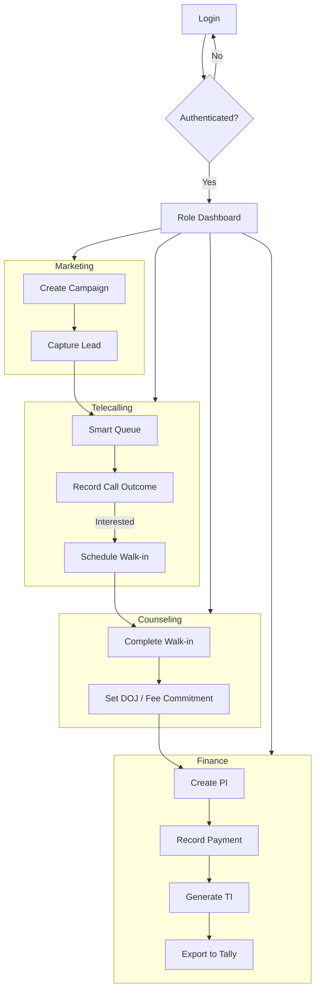

# CRM Frontend Architecture & Workflow Audit Report

## Context
This report provides a comprehensive audit of a Lovable-generated CRM application for "Red Apple Learning". It focuses on user relationship architecture, state management, and end-to-end frontend workflows.

---

## Task 1: Deep-Dive into User Relations & State

### 1. Authentication & Session Management
- **Auth Provider**: The application uses a React Context-based `AuthProvider` defined in `src/lib/auth-context.tsx`.
- **Session Lifecycle**:
    - **Initialization**: On mount, the provider attempts to hydrate the session from `localStorage` using the key `crm_current_user`.
    - **Storage**: User objects are stored as JSON strings in `localStorage`.
    - **Validation**: The frontend validates sessions by matching the stored ID against a hardcoded `allUsers` list in `auth-context.tsx`.
    - **Security Note**: Passwords for mock users are visible in the client-side code, and the session storage is insecure (no token-based validation).

### 2. Role-Based Access Control (RBAC)
- **Roles Defined**: `admin`, `marketing_manager`, `telecaller`, `counselor`, `telecalling_manager`, `owner`, `alliance_manager`, `alliance_executive`, `accounts_manager`, `accounts_executive`.

### 3. User Hierarchy & Reporting Lines
Based on the approval engine logic (`approvals.ts`) and dashboard monitoring capabilities, the following hierarchy is enforced:

```
System Administrator / Owner
|
|-- Accounts Manager
|   |-- Accounts Executive
|
|-- Telecalling Manager
|   |-- Telecaller
|
|-- Marketing Manager
|
|-- Alliance Manager
|   |-- Alliance Executive
|
|-- Academic Counselor
```

**Key Hierarchical Interactions:**
- **Approvals**: `Alliance Executives` report to `Alliance Managers`. All managers (`Telecalling`, `Marketing`, `Alliance`) escalate to `Admin/Owner` for high-value approvals.
- **Finance Tiers**: Expense approvals follow a value-based chain: `Executive` (<₹5k) -> `Manager` (₹5k-₹25k) -> `Owner` (>₹25k).
- **Monitoring**: `Telecalling Manager` has specialized dashboard views to track individual `Telecaller` metrics (ATT, Connected Rate).

### 4. Enforcement Mechanism:
    - **Route Guard**: `AppLayout.tsx` contains logic to check if the `location.pathname` matches the allowed routes defined in `roleNavConfig` (found in `src/lib/role-config.ts`).
    - **UI Masking**: If a user attempts to access an unauthorized route, the `AppLayout` renders an "Access Denied" screen.
    - **Dynamic Navigation**: The sidebar menu is generated dynamically based on the user's role using `roleNavConfig`.
    - **Conditional Dashboards**: `RoleDashboard.tsx` acts as a router, rendering a specific dashboard component (e.g., `TelecallerDashboard`, `OwnerDashboard`) based on the logged-in user's role.

### 5. Data Association & Models
- **Tying User Identity to Entities**:
    - **Leads**: Linked to a Telecaller via `assignedTelecallerId` and to a Counselor via `assignedCounselor`.
    - **Call Logs**: Explicitly tied to the caller via `telecallerId`.
    - **Campaigns**: Associated with managers via `marketingManager` and `campaignOwner` fields.
    - **Admissions**: Connected to leads via `leadId`, implicitly inheriting the telecaller/counselor associations.
- **Relational Expectations**: The frontend expects a relational structure where entities refer to each other by ID. It relies on a centralized "store" (`src/lib/mock-data.ts` and `src/lib/finance-store.ts`) that manages these relations in-memory and persists them to `localStorage`.

### 6. State Management
- **Flow of User Object**: `localStorage` / Login Form -> `AuthProvider` State -> `AuthContext` -> `useAuth()` Hook -> UI Components.
- **Data Persistence**: Most CRM data uses a custom store pattern with `useSyncExternalStore` (in Finance) or manual state updates coupled with `localStorage` saves. This ensures some degree of reactivity across the app.

---

## Task 2: Total Workflow Mapping

### 1. Routing Architecture
| Route | Access | Component | Purpose |
| :--- | :--- | :--- | :--- |
| `/login` | Public | `LoginPage` | User Authentication |
| `/` | Private | `RoleDashboard` | Role-specific landing page |
| `/leads` | Private | `LeadsPage` | Lead management (List/Kanban/Dashboard) |
| `/telecalling`| Private | `TelecallingPage` | High-volume calling workspace |
| `/counseling` | Private | `CounselingPage` | Walk-in and conversion management |
| `/accounts` | Private | `AccountsPage` | Finance, Invoicing (PI/TI), and Expenses |
| `/campaigns` | Private | `CampaignsPage` | Marketing performance and attribution |

### 2. Core User Journeys

#### A. Lead Acquisition & Assignment
1. **Marketing Manager** creates a Campaign in `/campaigns`.
2. Lead enters system (Manual entry via `MarketingLeadForm` or simulated capture).
3. System auto-assigns lead to a **Telecaller** using round-robin logic (defined in `LeadsPage.tsx`).

#### B. Telecalling & Qualification
1. **Telecaller** views `Smart Queue` in `/telecalling`.
2. Telecaller opens `Workspace` for a lead and starts a call.
3. Call outcome is recorded. If interested, a **Walk-in** or **Counseling** session is scheduled, and the lead is assigned to a **Counselor**.

#### C. Counseling & Admission
1. **Counselor** manages scheduled walk-ins in `/counseling`.
2. Counselor records `Counseling Outcome` and `Expected Date of Joining (DoJ)`.
3. Counselor converts the qualified lead into an `Admission` record in `/admissions`.

#### D. Billing & Finance
1. **Accounts Executive** creates a **Proforma Invoice (PI)** for the new admission in `/accounts`.
2. Payment is received and recorded.
3. PI is partially or fully converted into a **Tax Invoice (TI)** to realize revenue and lock GST liability.

### 3. Component Interaction Flow
- **Event-Driven Communication**: Many components communicate via side effects of user actions. For example, submitting a call outcome in `TelecallingPage` triggers a `store.saveLeads()` call. Other components that read from `store.getLeads()` will reflect this change upon their next mount or state update.
- **Form-to-Store Pattern**: Forms (like `MarketingLeadForm` or `LeadCreateForm`) directly interface with the `store` object to persist data. They do not pass data up to a parent via props in most cases; instead, they act as "leaf" nodes that modify the global mock database.
- **Contextual Propagating**: The `useAuth` hook provides the user's identity and role to all major layout components (`AppLayout`, `Sidebar`), which then filter navigation and dashboard views accordingly.

### 4. Mermaid Diagram: CRM Lifecycle



---

## Brittle Areas & Audit Flags

1.  **Insecure RBAC**: Role checks are performed exclusively on the client side. A user can easily bypass these checks by modifying the application state or local storage.
2.  **Plaintext Storage**: Sensitive user information, including mock passwords, is stored in `localStorage` without encryption.
3.  **Manual Data Synchronization**: The application relies on manual `window.location.reload()` calls or explicit state updates to reflect changes in `localStorage`. This is prone to race conditions and data inconsistency across browser tabs.
4.  **Mock Store Coupling**: The core business logic is tightly coupled with the `mock-data.ts` and `store` objects. Transitioning to a real REST/GraphQL API will require a significant refactor of the data access layer.
5.  **Lack of Error Boundaries**: There is minimal evidence of global or component-level error boundaries for handling data corruption or failed "API" calls.
6.  **Direct LocalStorage Interaction**: Components directly call `store.saveLeads()` etc., which circumvents potential middleware or validation layers that a centralized state manager (like Redux or a robust React Query setup) would provide.
7.  **Unused Boilerplate (React Query)**: While `App.tsx` initializes a `QueryClientProvider`, the application does not actually utilize `useQuery` or `useMutation` for data fetching. Instead, it relies on synchronous `localStorage` reads. This creates a misleading architectural footprint.
